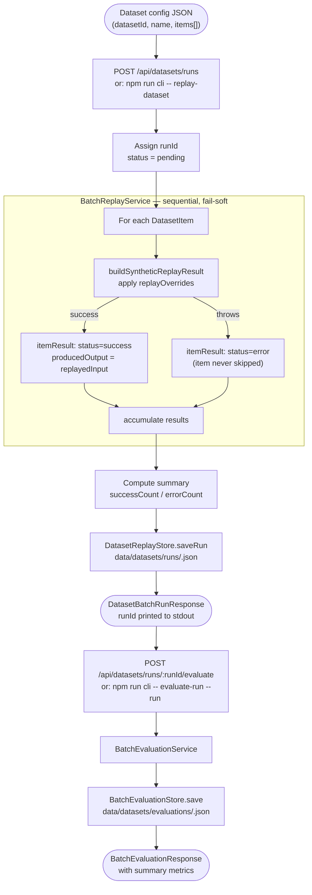

# Dataset Replay Workflow

A dataset workflow takes a named collection of input items, processes them all through the replay engine, optionally evaluates the outputs, and persists the results for later comparison. It is the primary way to run systematic agent tests against a fixed benchmark.

## End-to-end Flow



## Synthetic Replay IDs

Dataset items are not linked to any existing trace in the trace store. `BatchReplayService` therefore generates synthetic IDs that are clearly prefixed to distinguish them from real trace references:

```
replayId      →  "replay_dset_<itemId>_<uuid-8>"
sourceTraceId →  "synthetic_dataset_<datasetId>_item_<itemId>"
targetStepId  →  "synthetic_step_<itemId>"
```

## Dataset Config Format

```json
{
  "datasetId":   "ds-summariser-v2",
  "name":        "Summariser benchmark v2",
  "description": "50 news articles with expected one-sentence summaries",
  "items": [
    {
      "itemId":         "art-001",
      "input":          { "prompt": "Summarise the following article: ..." },
      "expectedOutput": "Scientists discover new exoplanet in habitable zone."
    }
  ],
  "replayOverrides": {
    "overridePrompt": "Summarise in exactly one sentence."
  }
}
```

`replayOverrides` is optional. When present, it is applied on top of every item's `input` using the same merge strategy as the single-step replay engine.

## Storage Layout

```
data/datasets/
├── runs/
│   ├── index.json            ← DatasetRunSummary[] newest-first
│   └── <runId>.json          ← DatasetBatchRunResponse (full)
└── evaluations/
    └── <runId>.json          ← BatchEvaluationResponse
```

## Run Status Transitions

```
pending
   │
   └──► running  (BatchReplayService.runDatasetReplay starts)
              │
              ├──► success  (errorCount === 0)
              └──► error    (errorCount > 0, all items still processed)
```

The `error` status means at least one item failed; it does not mean the run was aborted. All item results are still present in the response.

## API Reference

| Endpoint | Description |
|---|---|
| `POST /api/datasets/runs` | Execute a batch replay and return the run |
| `GET /api/datasets/runs` | List all run summaries (newest-first) |
| `GET /api/datasets/runs/:runId` | Get full run response |
| `POST /api/datasets/runs/:runId/evaluate` | Evaluate a completed run |
| `GET /api/datasets/runs/:runId/evaluations` | Get stored evaluation for a run |
