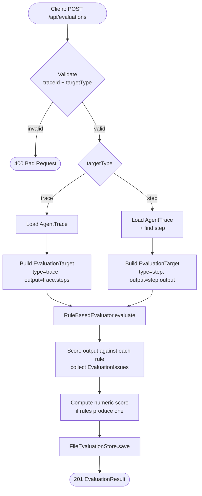

# Evaluation Pipeline

The evaluation pipeline scores agent outputs against a set of rules and produces structured `EvaluationResult` objects. It operates at two levels: single-trace / single-step evaluation and batch evaluation across a full dataset run.

## Single-trace Evaluation Flow



## Rule-based Evaluator

`RuleBasedEvaluator` applies each registered rule sequentially. Rules are pure functions: they receive an `EvaluationTarget` and return zero or more `EvaluationIssue` objects.

```
EvaluationTarget
├── traceId
├── targetType   "trace" | "step"
├── stepId?
└── output       unknown  ← the value being scored

                  ▼

Rule 1 (e.g. EMPTY_OUTPUT)      → push issue if output is empty
Rule 2 (e.g. STEP_ERROR_STATUS) → push issue if any step has status=error
Rule 3 (e.g. HIGH_LATENCY)      → push issue if total latency > threshold
...

                  ▼

EvaluationResult
├── evaluationId
├── target
├── evaluatorName  "RuleBasedEvaluator"
├── status         success | error
├── issues[]
│   ├── code       string (unique per rule)
│   ├── severity   error | warning
│   └── message    human-readable description
├── score?         optional numeric aggregate
├── startedAt
└── completedAt
```

## Batch Evaluation Flow

Batch evaluation is used after a dataset replay run to score all item outputs in one pass.

```mermaid
flowchart TD
    A([POST /api/datasets/runs/:runId/evaluate]) --> B[DatasetReplayStore.getRun]
    B -->|not found| ERR([404])
    B -->|found| C[BatchEvaluationService.evaluateDatasetRun]

    subgraph batch["BatchEvaluationService — per item (fail-soft)"]
        C --> D[buildEvaluatorContext\nbuildEvaluationTarget]
        D --> E[RuleBasedEvaluator.evaluate]
        E -->|success| F[ItemEvaluation: evaluations=[result]]
        E -->|throws| G[ItemEvaluation: status=error]
        F --> H[accumulate]
        G --> H
    end

    H --> I[computeSummary]
    I --> J[BatchEvaluationStore.save\ndata/datasets/evaluations/<runId>.json]
    J --> K([200 BatchEvaluationResponse])
```

**Fail-soft guarantee:** an unexpected exception on one item produces an `ItemEvaluation` with `status=error` — the remaining items are still evaluated.

## BatchEvaluationSummary Fields

| Field | Description |
|---|---|
| `totalItems` | Total items in the dataset run |
| `evaluatedItems` | Items with at least one successful evaluation |
| `issueCount` | Total issue instances across all evaluations |
| `errorIssueCount` | Issues with `severity=error` |
| `warningIssueCount` | Issues with `severity=warning` |
| `averageScore` | Mean score across all scored evaluations (optional) |
| `successRate` | Fraction of evaluated items with zero issues |

`successRate` and `averageScore` are the primary quality signals consumed by the regression report pipeline.

## Evaluation Storage

```
data/evaluations/
└── <evaluationId>.json    ← single-trace EvaluationResult

data/datasets/evaluations/
└── <runId>.json           ← BatchEvaluationResponse (keyed by runId, overwritten on re-evaluation)
```

Re-evaluating a run overwrites the existing file. There is no evaluation history for batch runs — only the most recent result is kept.
