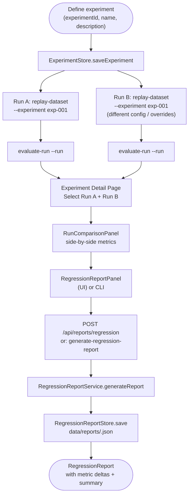
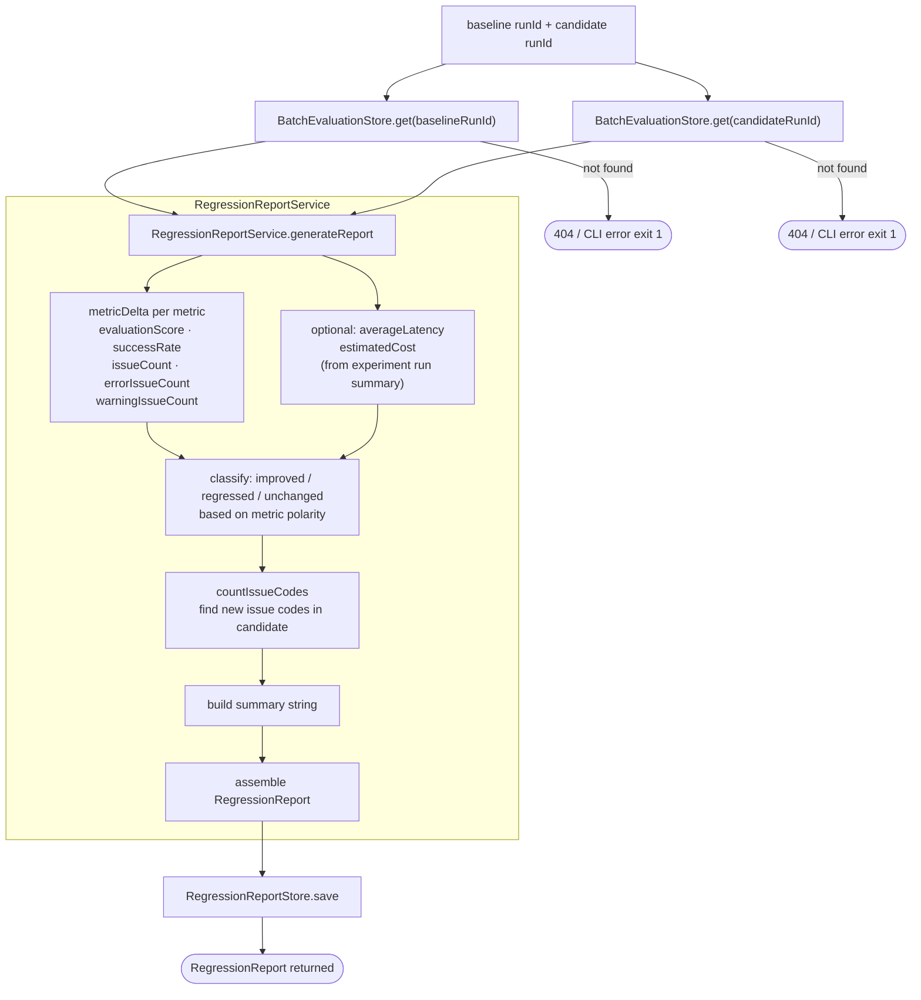
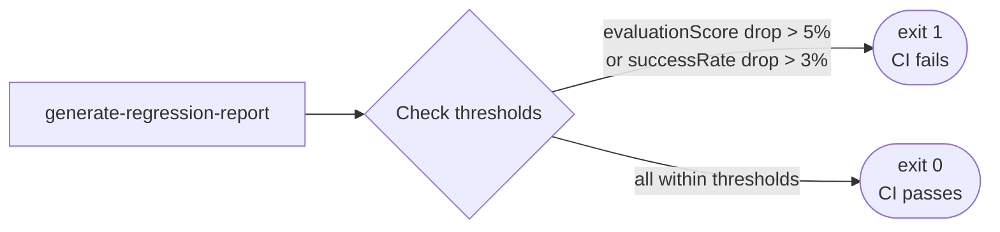

# Experiment Workflow

An experiment is a named container that groups dataset runs for systematic A/B comparison. The workflow covers creating runs under an experiment, comparing them in the UI, and generating a regression report that quantifies the difference.

## Full Experiment Lifecycle



## Regression Report Generation



## Metric Polarity

| Metric | Polarity | Improved when |
|---|---|---|
| `evaluationScore` | higher-better | candidate > baseline |
| `successRate` | higher-better | candidate > baseline |
| `issueCount` | lower-better | candidate < baseline |
| `errorIssueCount` | lower-better | candidate < baseline |
| `warningIssueCount` | lower-better | candidate < baseline |
| `averageLatency` | lower-better | candidate < baseline |
| `estimatedCost` | lower-better | candidate < baseline |

## RegressionReport Structure

```
RegressionReport
├── reportId         "report_<timestamp>_<random>"
├── baselineRunId
├── candidateRunId
├── createdAt
├── summary          human-readable one-liner
└── comparison
    ├── baselineRunId
    ├── candidateRunId
    ├── metricDeltas[]
    │   ├── metric           string
    │   ├── baselineValue?   number
    │   ├── candidateValue?  number
    │   ├── absoluteDelta?   candidate - baseline
    │   ├── percentageDelta? absoluteDelta / |baseline| × 100
    │   └── status           improved | regressed | unchanged
    └── issueDeltas[]
        ├── issueCode
        ├── baselineCount
        ├── candidateCount
        ├── delta            candidateCount - baselineCount
        └── status           improved | regressed | unchanged
```

Issue deltas are sorted by `|delta|` descending — the most-changed codes appear first.

## CI Regression Gate



Thresholds are defined in `src/cli/commands/generate-regression-report.ts` as a `THRESHOLDS` constant and can be adjusted per project.

## Experiment API Reference

| Endpoint | Description |
|---|---|
| `GET /api/experiments` | List all experiments with run counts |
| `GET /api/experiments/:experimentId` | Get experiment + all runs with summaries |
| `GET /api/experiments/:experimentId/runs/:runId` | Get single run with summary |
| `POST /api/reports/regression` | Generate and persist a regression report |
| `GET /api/reports/:reportId` | Retrieve a stored regression report |
