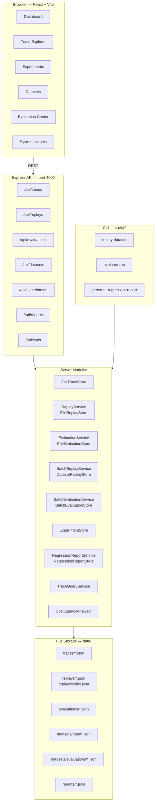
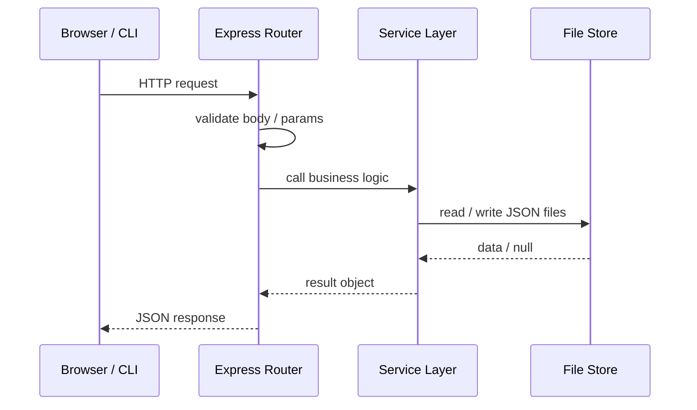

# System Architecture

AgentScope Studio is a three-layer system: a React frontend, an Express REST API, and a file-based storage tier. All layers communicate through well-typed TypeScript interfaces shared via the `src/core/` model package.

## Component Map



## Data Flow (request lifecycle)



## Module Dependency Rules

```
src/core/          ← imported by both server and frontend
src/server/        ← imports core only (never frontend)
src/cli/           ← imports core + server services (never frontend)
frontend/src/      ← imports core types (mirrored locally) + own features
```

Core modules contain **only type definitions** — no runtime logic, no I/O. This keeps them importable from any layer without pulling in Node.js-specific code.

## Storage Layout

```
data/
├── traces/
│   └── <traceId>.json           # AgentTrace
├── replays/
│   ├── index.json               # compact ReplayResult[] index (newest-first)
│   └── <replayId>.json          # full ReplayResult
├── evaluations/
│   └── <evaluationId>.json      # EvaluationResult
├── datasets/
│   ├── runs/
│   │   ├── index.json           # DatasetRunSummary[] index (newest-first)
│   │   └── <runId>.json         # DatasetBatchRunResponse
│   └── evaluations/
│       └── <runId>.json         # BatchEvaluationResponse (keyed by runId)
└── reports/
    └── <reportId>.json          # RegressionReport
```

Write order for indexed stores: full file first, then index update. A crash between the two leaves the full file intact — it is still retrievable by ID even if absent from the index.
