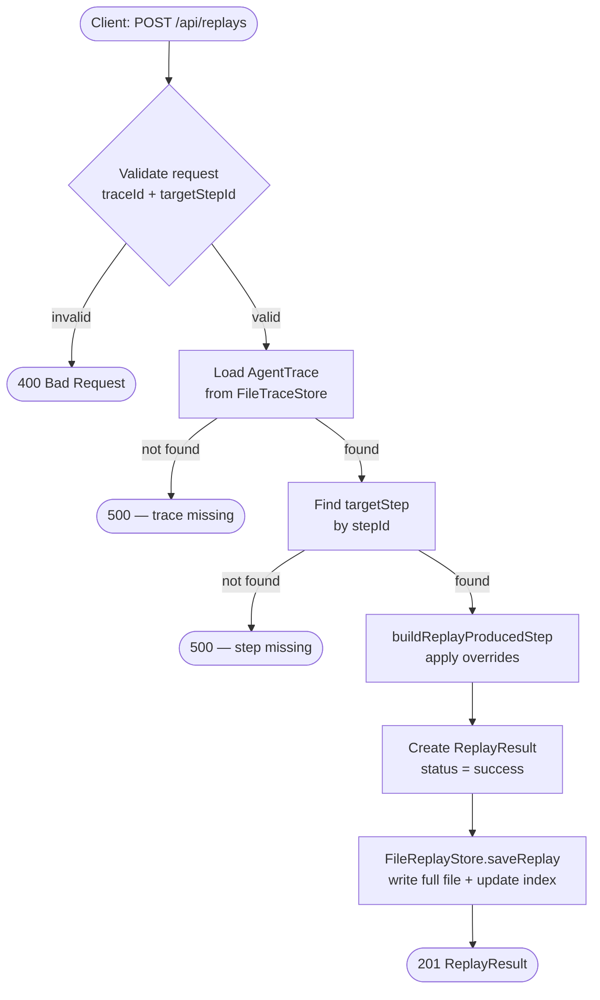

# Replay Pipeline

The replay pipeline re-runs a single agent step with modified inputs, records the result, and links it back to the original trace. It is used to explore counterfactuals: "what would the agent have produced if the prompt had been different?"

## Step Replay Flow



## Override Merge Strategy

Overrides are applied in fixed precedence order. Later steps win.

```
Original step.input
       │
       ▼
  [1] base: if input is a plain object → spread it
            if input is primitive / array → wrap as { value: input }
       │
       ▼
  [2] overridePrompt → adds / overwrites the "prompt" key
       │
       ▼
  [3] overrideInput  → if plain object: object-merge (highest precedence)
                       if primitive / array: full replacement
       │
       ▼
  replayedInput  (the merged input the agent would receive)
```

**Example:**

```
Original input:        { prompt: "Summarise.", context: "..." }
overridePrompt:        "Be concise."
overrideInput:         { temperature: 0.2 }

Result replayedInput:  { prompt: "Be concise.", context: "...", temperature: 0.2 }
```

## ReplayResult Structure

```
ReplayResult
├── replayId          "replay_<uuid>"
├── sourceTraceId     original trace ID
├── targetStepId      original step ID
├── status            success | error
├── startedAt
├── completedAt
├── errorMessage?     present on error
└── producedStep
    ├── originalStepId
    ├── originalType
    ├── originalInput
    ├── originalOutput
    ├── appliedOverrides
    └── replayedInput   ← the merged input
```

## Storage: FileReplayStore

The store maintains two artefacts:

```
data/replays/
├── index.json           ← compact array, newest-first, updated atomically
└── <replayId>.json      ← full ReplayResult per replay
```

List operations read only the index. Full result retrieval reads one file by ID. A crash between writing the full file and updating the index leaves the full file intact — it remains retrievable by `replayId`.

## Filtering replays

`GET /api/traces/:traceId/replays` returns all replays for a source trace, newest first, with an optional `limit` query parameter. Internally this reads the index, filters by `sourceTraceId`, slices, then loads full files in parallel.
